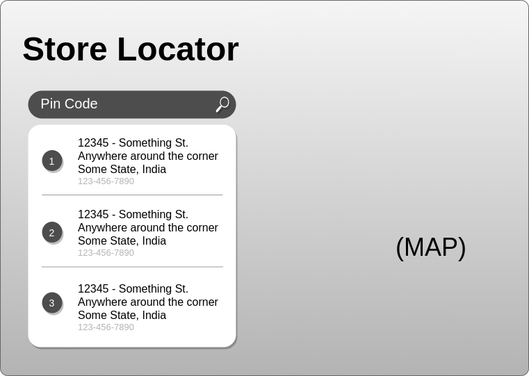
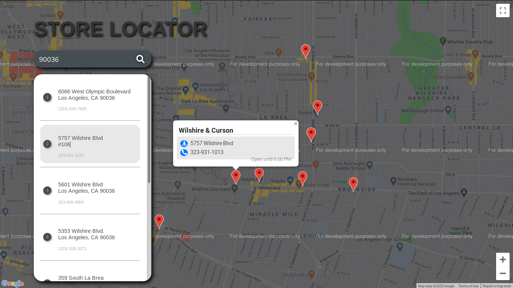

# Store Locator

### Introduction

A web-based app that utilizes the Google Maps API using JavaScript. An individual can enter a Pin-Code (or a Zip-Code) and can get the information of stores located in the periphery of that particular area.

### Technologies used

1. HTML 5
2. CSS 3
3. JavaScript ES-5

### Wireframe

### Usage

Just clone or download the repository and open the index.html file in a browser.
You can visit the link in the description for a demo.

### Screenshot

